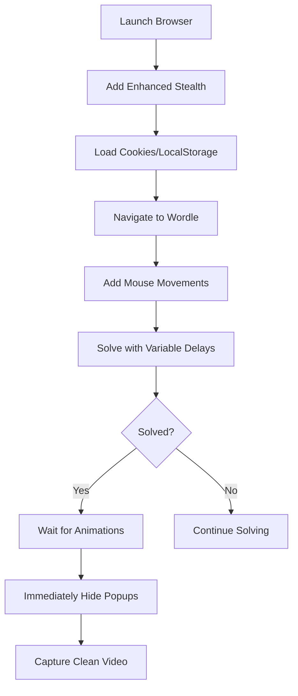

# Wordle Bot Popup Issue - Analysis & Solution Plan

## Problem Analysis

Based on the screenshot ([`image.png`](../image.png)), after successfully solving the Wordle puzzle, two problematic popups appear:

1. **"Create a free account to start tracking your stats and streaks"** - Account creation modal
2. **"You have been blocked from The New York Times because we suspect that you're a robot"** - Bot detection message

### Root Causes

#### 1. Bot Detection Triggers
The NYT Wordle site is detecting automated behavior due to:
- **Too-fast interactions**: Even with human delays, the pattern is predictable
- **Missing mouse movements**: Playwright doesn't simulate natural mouse movement
- **Consistent timing patterns**: Random delays between fixed ranges create detectable patterns
- **Browser fingerprinting**: Despite stealth measures, some automation signals leak through
- **No cookies/session history**: Fresh browser context every time looks suspicious

#### 2. Popup Timing Issue
Looking at [`script.py:713-722`](../script.py:713), the code attempts to stop immediately after solving:
```python
if feedback == "22222":
    print(f"\n🎉 SOLVED! The word was: {best_word.upper()}")
    solved = True
    human_delay(0.5, 0.5)  # Only 0.5s delay
    end_trim = time.time() - video_start_time
    break
```

However, the popups appear **after** the puzzle is solved, and the current approach:
- Only waits 0.5 seconds after solving
- Relies on video trimming (cutting last 4 seconds) at [`script.py:784`](../script.py:784)
- The [`clean_up_ui()`](../script.py:613) function exists but is only called if NOT solved (line 738)

#### 3. Existing Cleanup Function Not Used
The [`clean_up_ui()`](../script.py:613) function at lines 613-676 has logic to hide these exact popups:
- Searches for text like "Create a free account", "You have been blocked", "suspect that you are a bot"
- Hides modal dialogs and overlays
- But it's **only called when the puzzle is NOT solved** (line 738)

## Solution Strategy

### Approach 1: Enhanced Bot Evasion (Recommended)
Prevent the popups from appearing in the first place by making the bot less detectable.



**Key Improvements:**
1. **Persistent Session**: Save and reuse cookies/localStorage to appear as returning user
2. **Mouse Movement Simulation**: Add random mouse movements during gameplay
3. **Variable Delay Patterns**: Use more sophisticated randomization
4. **Enhanced Browser Fingerprinting**: Better stealth configuration
5. **Proactive Popup Blocking**: Inject CSS/JS to prevent popups before they appear

### Approach 2: Reactive Popup Handling (Fallback)
If popups still appear, aggressively remove them before they're recorded.

**Key Improvements:**
1. Call [`clean_up_ui()`](../script.py:613) **immediately after solving** (before the 0.5s delay)
2. Add continuous popup monitoring during the final delay
3. Inject CSS to hide popups via `display: none !important`
4. Use more aggressive DOM manipulation

### Approach 3: Hybrid Solution (Best)
Combine both approaches for maximum reliability.

## Detailed Implementation Plan

### Phase 1: Enhanced Stealth Measures

#### 1.1 Persistent Browser Session
```python
# Save cookies and localStorage after first successful run
# Reuse them in subsequent runs to appear as returning user
```

**Files to modify:**
- [`script.py`](../script.py) - Add session persistence logic

**Changes:**
- Create `browser_session.json` to store cookies/localStorage
- Load session data before navigating to Wordle
- Save session data after successful solve

#### 1.2 Mouse Movement Simulation
```python
# Add random mouse movements during delays
# Move to random coordinates, hover over keys before clicking
```

**Files to modify:**
- [`script.py:554-578`](../script.py:554) - Enhance `type_word()` function

**Changes:**
- Add mouse movement to random coordinates before typing
- Hover over keyboard keys before clicking them
- Add occasional "thinking" pauses with mouse movement

#### 1.3 Advanced Delay Randomization
```python
# Use exponential/normal distribution instead of uniform
# Add occasional longer pauses to simulate "thinking"
```

**Files to modify:**
- [`script.py:393-397`](../script.py:393) - Enhance `human_delay()` function

**Changes:**
- Use `random.gauss()` for more natural timing
- Add 10% chance of "thinking pause" (2-5 seconds)
- Vary delay patterns based on game state

#### 1.4 Enhanced Browser Configuration
```python
# Add more realistic browser fingerprint
# Use real Chrome user data directory
```

**Files to modify:**
- [`script.py:475-496`](../script.py:475) - Enhance browser launch config

**Changes:**
- Add more browser arguments for stealth
- Set realistic screen resolution and color depth
- Add WebGL and Canvas fingerprint randomization

### Phase 2: Proactive Popup Prevention

#### 2.1 CSS Injection
Inject CSS rules to hide popups before they appear:

```javascript
// Inject at page load
const style = document.createElement('style');
style.textContent = `
  div[role="dialog"]:has-text("Create a free account") { display: none !important; }
  div:has-text("You have been blocked") { display: none !important; }
  .Modal-module_modalOverlay__eaFhH { display: none !important; }
`;
document.head.appendChild(style);
```

**Files to modify:**
- [`script.py:504-509`](../script.py:504) - Add to `add_init_script()`

#### 2.2 JavaScript Popup Blocker
Override popup/modal functions:

```javascript
// Prevent modals from showing
window.addEventListener('DOMNodeInserted', (e) => {
  if (e.target.innerText?.includes('Create a free account') || 
      e.target.innerText?.includes('You have been blocked')) {
    e.target.remove();
  }
});
```

**Files to modify:**
- [`script.py:504-509`](../script.py:504) - Add to `add_init_script()`

### Phase 3: Reactive Popup Cleanup

#### 3.1 Call clean_up_ui() After Solving
**Files to modify:**
- [`script.py:713-722`](../script.py:713) - Modify solve success block

**Current code:**
```python
if feedback == "22222":
    print(f"\n🎉 SOLVED! The word was: {best_word.upper()}")
    solved = True
    human_delay(0.5, 0.5)
    end_trim = time.time() - video_start_time
    break
```

**New code:**
```python
if feedback == "22222":
    print(f"\n🎉 SOLVED! The word was: {best_word.upper()}")
    solved = True
    
    # IMMEDIATELY clean up any popups before they appear in video
    clean_up_ui(page)
    
    # Wait for green animation to complete
    human_delay(0.5, 1.0)
    
    # Clean up again in case popups appeared during delay
    clean_up_ui(page)
    
    end_trim = time.time() - video_start_time
    break
```

#### 3.2 Enhance clean_up_ui() Function
**Files to modify:**
- [`script.py:613-676`](../script.py:613) - Enhance `clean_up_ui()` function

**Improvements:**
- Add more aggressive DOM manipulation
- Use CSS injection for immediate hiding
- Add retry logic (call multiple times)
- Hide by class names and data attributes, not just text content

### Phase 4: Video Trimming Improvements

#### 4.1 Better End Trim Logic
**Files to modify:**
- [`script.py:782-793`](../script.py:782) - Improve video trimming

**Current issue:**
- Always cuts last 4 seconds, which might be too much or too little
- Doesn't account for when popups actually appear

**Improvement:**
- Use the `end_trim` timestamp set when puzzle is solved
- Add small buffer (0.5-1s) after solve for animation
- Don't rely on fixed "last 4 seconds" approach

**New code:**
```python
# Use the end_trim timestamp if available (set when puzzle solved)
if end_trim and end_trim > start_trim:
    # Add small buffer for animation completion
    video_end_time = end_trim + 1.0
    print(f"Trimming video: Start={start_trim:.2f}s, End={video_end_time:.2f}s")
    gameplay_clip = gameplay_clip.subclip(start_trim, video_end_time)
else:
    # Fallback: cut last 4 seconds
    video_end_time = gameplay_clip.duration - 4.0
    if video_end_time > start_trim:
        gameplay_clip = gameplay_clip.subclip(start_trim, video_end_time)
```

## Implementation Priority

### High Priority (Must Fix)
1. ✅ Call [`clean_up_ui()`](../script.py:613) immediately after solving (Phase 3.1)
2. ✅ Add CSS injection to prevent popups (Phase 2.1)
3. ✅ Improve video trimming to use `end_trim` timestamp (Phase 4.1)

### Medium Priority (Recommended)
4. ⚠️ Enhance [`clean_up_ui()`](../script.py:613) with more aggressive cleanup (Phase 3.2)
5. ⚠️ Add mouse movement simulation (Phase 1.2)
6. ⚠️ Improve delay randomization (Phase 1.3)

### Low Priority (Nice to Have)
7. 💡 Persistent browser session with cookies (Phase 1.1)
8. 💡 Enhanced browser fingerprinting (Phase 1.4)
9. 💡 JavaScript popup blocker (Phase 2.2)

## Expected Outcomes

After implementing the high-priority fixes:
- ✅ Popups will be hidden before they appear in the video
- ✅ Video will be trimmed precisely at the solve moment
- ✅ Clean, professional-looking video without interruptions

After implementing medium-priority fixes:
- ✅ Reduced bot detection rate
- ✅ More natural-looking automation
- ✅ Better reliability

After implementing low-priority fixes:
- ✅ Minimal bot detection
- ✅ Appears as legitimate user
- ✅ Long-term sustainability

## Testing Strategy

1. **Local Testing**: Run script locally and verify:
   - Popups don't appear in final video
   - Video ends cleanly after solve
   - No "blocked" messages visible

2. **Multiple Runs**: Test 3-5 consecutive days to ensure:
   - Consistent behavior
   - No degradation over time
   - Session persistence works (if implemented)

3. **Manual Verification**: Watch final video to confirm:
   - Clean solve animation
   - No popups visible
   - Proper timing and transitions

## Risk Assessment

### Low Risk Changes
- Calling [`clean_up_ui()`](../script.py:613) after solving
- CSS injection for popup hiding
- Video trimming improvements

### Medium Risk Changes
- Mouse movement simulation (might cause timing issues)
- Delay randomization (might slow down solving)

### High Risk Changes
- Browser fingerprinting changes (might break existing functionality)
- Session persistence (might cause authentication issues)

## Rollback Plan

If changes cause issues:
1. Keep original [`script.py`](../script.py) as `script.py.backup`
2. Test each change incrementally
3. Can revert to working version if needed
4. Use git to track changes and enable easy rollback

## Next Steps

1. Review this plan and confirm approach
2. Implement high-priority fixes first
3. Test locally to verify popup removal
4. Deploy and monitor for 2-3 days
5. Implement medium-priority fixes if needed
6. Consider low-priority enhancements for long-term improvement
